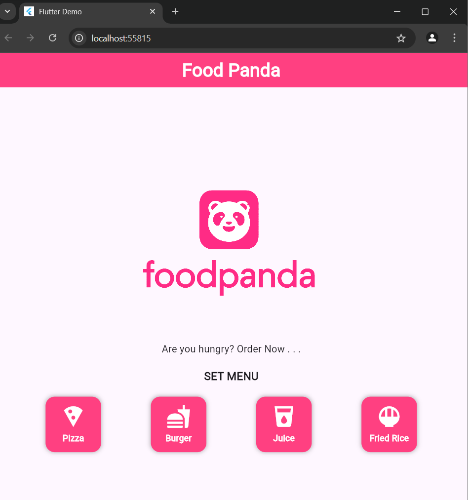

# **Food Delivery App**

A **Flutter-based** mobile application designed for food delivery, allowing users to easily order their favorite food from nearby restaurants. The app provides a seamless and efficient ordering experience with a modern and interactive UI.

# **📸 Screenshots**

## **🏡 Home Screen**

# ✨ **Features**

- 🍔 **Browse Restaurants and Menus**
- 🛍️ **Add Items to Cart**
- 💳 **Secure Online Payment Integration**
- 🚚 **Real-time Order Tracking**
- 🎨 **Modern & Interactive UI**
- ⚡ **State Management using GetX**
- 📣 **Snackbar for error handling**
- 🌙 **Smooth User Experience**

# 👤 **Author**

**Your Name**  
📧 Email: faysalf716@gmail.com
🔗 GitHub: [My GitHub Profile](https://github.com/faysalcsecu)  
🔗 LinkedIn: [My LinkedIn Profile](https://www.linkedin.com/in/faysal-bin-alauddin-4815a92a7/)

💡 **Developed with Flutter by Faysal Bin Alauddin**